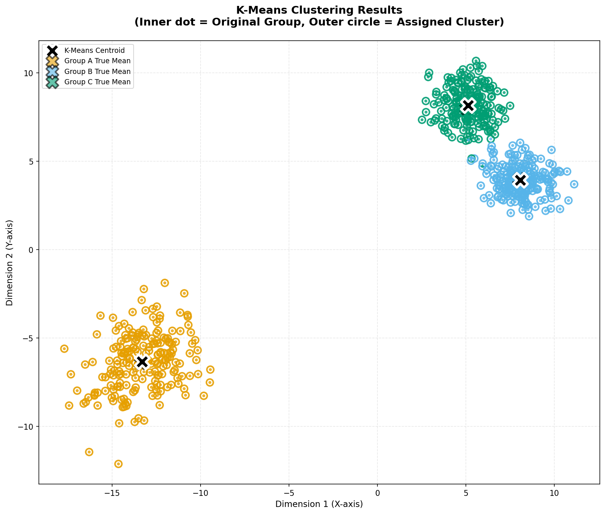
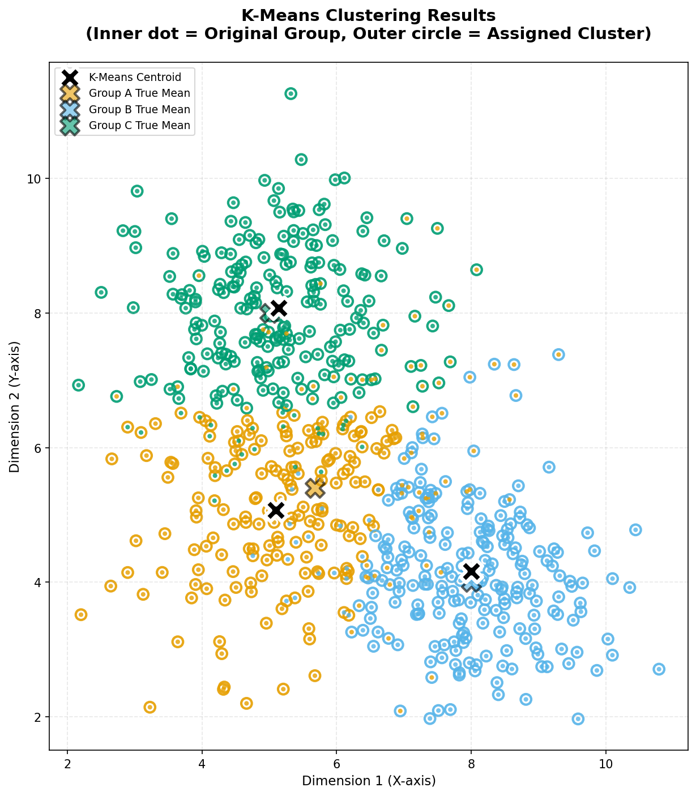
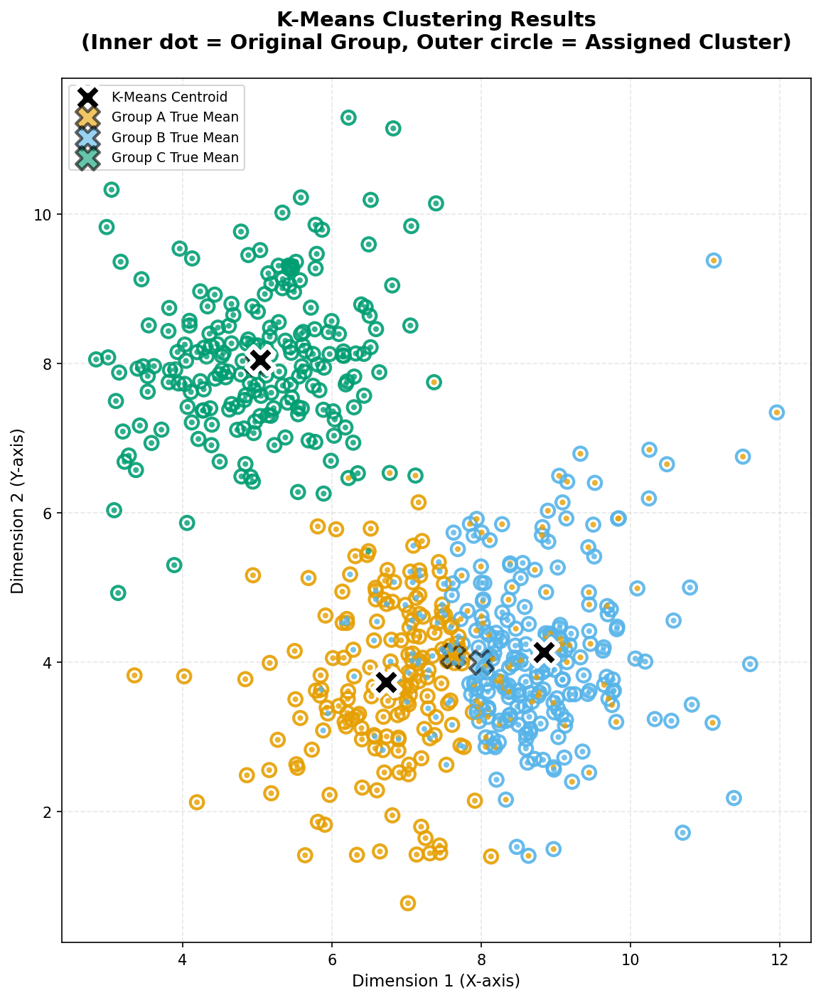

# L15: Interactive K-Means Clustering Educational Simulator


**Transform abstract K-Means theory into tangible, visual learning!** This educational tool is designed for students, developers, and data science enthusiasts who want to build deep, intuitive understanding of how K-Means clustering works.

[](https://www.python.org/downloads/)
[](https://opensource.org/licenses/MIT)
[](https://github.com/hadarwayn)

**Developed for:** AI Developer Expert Course  
**Reference:** Dr. Yoram Segal's "K-MEAN Book v2.0, Chapter 11"

---

## 📖 Table of Contents

- [What is K-Means Clustering?](#-what-is-k-means-clustering)
- [Educational Goals](#-educational-goals)
- [Features](#-features)
- [Installation & Setup](#-installation--setup)
- [How to Use the Simulator](#%EF%B8%8F-how-to-use-the-simulator)
- [Understanding the Visualization](#-understanding-the-visualization)
- [Experiment Examples](#-experiment-examples)
- [Understanding the Metrics](#-understanding-the-metrics)
- [Results Gallery](#-results-gallery)
- [Statistical Deep Dive](#-statistical-deep-dive)
- [Troubleshooting](#-troubleshooting)
- [References](#-references)
- [License](#-license)

---

## 🎯 What is K-Means Clustering?

**K-Means** is one of the most popular **unsupervised learning** algorithms in machine learning. It groups data points into K clusters based on their similarity (distance).

### Simple Analogy
Imagine you have a bag of mixed colorful candies, and you want to sort them into 3 piles based on their colors. K-Means does something similar with data points in multi-dimensional space—it finds the "center" of each group and assigns points to the nearest center.

### The Algorithm (Simplified)
1. **Start:** Pick K random points as initial "centers" (centroids)
2. **Assignment Step:** Assign each data point to its nearest center
3. **Update Step:** Recalculate centers as the average of assigned points
4. **Repeat:** Steps 2-3 until centers stop moving

This simulator lets you **see this process visually** and **experiment with different scenarios**!

---

## 🎓 Educational Goals

By using this simulator, you will learn to:

✅ **Visualize** the iterative nature of K-Means (Assignment + Update steps)  
✅ **Understand** key concepts: centroids, inertia (WCSS), Silhouette scores  
✅ **Explore** failure modes: non-spherical clusters, overlaps, variance issues  
✅ **Develop** intuition for how data distribution affects clustering  
✅ **Connect** theory to practice through hands-on experiments  

---

## ✨ Features

| Feature | Description |
|---------|-------------|
| **🖱️ Drag & Drop** | Click and drag entire groups to new positions |
| **💥 Variance Explosion** | Increase group spread to simulate less-defined clusters |
| **🎨 Dual-Color Encoding** | See original groups (fill) vs. K-Means assignments (edge) |
| **📊 Real-Time Metrics** | Inertia, Silhouette Score, Between-Cluster Scatter |
| **📖 Educational Explanations** | Plain-language analysis of why K-Means behaved as it did |
| **💾 Auto-Save Results** | Each experiment automatically saved to `results/` folder |
| **🎨 Beautiful UI** | Pastel colors, clear instructions, intuitive controls |

---

## 🚀 Installation & Setup

### Prerequisites

- **Python 3.10 or higher** ([Download Python](https://www.python.org/downloads/))
- **Git** ([Download Git](https://git-scm.com/downloads/))

### Step 1: Clone the Repository

Open your terminal (Command Prompt on Windows, Terminal on Mac/Linux) and run:

```bash
git clone https://github.com/hadarwayn/L15-Clustering-using-K-Mean.git
cd L15-Clustering-using-K-Mean
```

### Step 2: Set Up Virtual Environment

**Windows:**
```bash
python -m venv .venv
.venv\Scripts\activate
```

**macOS/Linux:**
```bash
python3 -m venv .venv
source .venv/bin/activate
```

### Step 3: Install Dependencies

```bash
pip install -r requirements.txt
```

### Step 4: Run the Application

```bash
python src/main.py
```

The application window should appear with the title **"🎯 K-Means Clustering Interactive Simulator"**.

---

## 🕹️ How to Use the Simulator

### GUI Overview


The interface is divided into three main areas:

1. **Control Panel (Left):** 5-step workflow with clear instructions
2. **Visualization Canvas (Center):** Interactive plot where you manipulate data
3. **Results Panel (Bottom):** Detailed statistical analysis after running K-Means

### 5-Step Workflow

#### 📍 STEP 1: Select a Group

Choose which group (A, B, or C) you want to manipulate:
- **Group A (Orange):** Initially at position (2, 3)
- **Group B (Blue):** Initially at position (8, 4)
- **Group C (Green):** Initially at position (5, 8)

#### 🖱️ STEP 2: Drag the Group

Click and drag the selected group's center (large **X** marker) to move it:
- **Left-click and hold** on the X marker
- **Drag** to new position
- **Release** to place

💡 **Tip:** Try dragging Group A close to Group B to create overlap!

#### 💥 STEP 3: Explode Variance (Optional)

Use the slider to set variance multiplier (1.0× to 5.0×), then click **"💥 Explode Selected Group"**:
- **1.0×:** No change
- **2.0×:** Double the spread (default)
- **5.0×:** Extremely scattered points

💡 **Tip:** Exploding a group makes it less dense, violating K-Means' spherical assumption!

#### 🤖 STEP 4: Run Clustering

Click **"🤖 Run K-Means (K=3)"** to execute the algorithm:
- Algorithm finds 3 clusters
- Points' edge colors update to show cluster assignments
- Black **X** markers appear at computed centroids
- Detailed analysis appears in Results Panel

#### 🔄 STEP 5: Reset

Click **"🔄 Start Over"** to return to initial configuration:
- All groups restored to original positions
- Variances reset to defaults
- K-Means results cleared

---

## 🎨 Understanding the Visualization

### Point Encoding System

After running K-Means, each point has **two colors**:

| Visual Element | Meaning |
|----------------|---------|
| **Small colored dot (center)** | Original "ground truth" group |
| **Large colored circle (edge)** | K-Means cluster assignment |
| **Matching colors** | Point stayed in original group ✅ |
| **Different colors** | Point was reassigned to different cluster ⚠️ |

**Example:**
- Orange dot + Orange circle = Point from Group A, correctly assigned to orange cluster
- Orange dot + Blue circle = Point from Group A, **misclassified** into blue cluster

### Marker Types

| Marker | Description |
|--------|-------------|
| **Semi-transparent colored X** | True mean (actual center of original Gaussian group) |
| **Solid black X** | K-Means centroid (computed cluster center) |

**When these don't align:** Indicates "centroid drift" caused by overlapping or irregular clusters.

---

## 📊 Understanding the Metrics

### Inertia (Within-Cluster Sum of Squares - WCSS)

**Formula:** `J = Σ Σ ||x_i - μ_k||²`

**What it means:** Total squared distance of all points to their cluster centers.

**Interpretation:**
- **Lower is better** (tighter clusters)
- **Always decreases** as K increases
- **Not useful alone** for choosing K

**Example:** Inertia = 347.82 means if you sum up all squared distances from points to their centroids, you get 347.82 units².

---

### Silhouette Score

**Formula:** `s = (b - a) / max(a, b)`  
Where:
- `a` = Average distance to points in same cluster
- `b` = Average distance to points in nearest other cluster

**Interpretation:**

| Range | Quality | Meaning |
|-------|---------|---------|
| **0.7 to 1.0** | ✅ Excellent | Well-separated, tight clusters |
| **0.5 to 0.7** | ⚠️ Good | Reasonable separation with some overlap |
| **0.25 to 0.5** | ⚠️ Weak | Significant overlap, ambiguous boundaries |
| **-1.0 to 0.25** | ❌ Poor | Misclassified or no clear structure |

**Example:** Silhouette = 0.68 means clusters are well-separated but have minor boundary overlap.

---

### Between-Cluster Scatter (BCS)

**Formula:** `BCS = Σ |C_k| × ||μ_k - μ||²`

**What it means:** How far apart cluster centers are from the global center.

**Key Insight:** `Total Variance = WCSS + BCS`  
Therefore: **Minimizing WCSS ⇔ Maximizing BCS**

**Interpretation:**
- **Higher BCS** = centroids well-separated
- **Lower BCS** = centroids clustered together

---

## 📚 Statistical Deep Dive

### K-Means Algorithm (Lloyd's Algorithm, 1957)

**Mathematical Formulation:**

Given dataset `X = {x₁, x₂, ..., xₙ}` where `xᵢ ∈ ℝᵈ`, partition into K clusters `C = {C₁, C₂, ..., Cₖ}` to minimize:

```
J(C, μ) = Σₖ Σᵢ∈Cₖ ||xᵢ - μₖ||²
```

Where `μₖ = (1/|Cₖ|) Σᵢ∈Cₖ xᵢ` is the centroid of cluster Cₖ.

**Iterative Steps:**

1. **Assignment:** `cᵢ = argminₖ ||xᵢ - μₖ||²`
2. **Update:** `μₖ = (1/|Cₖ|) Σᵢ∈Cₖ xᵢ`
3. **Repeat** until convergence (no change in assignments)

**Convergence Guarantee:** The algorithm **always converges** to a local minimum (but not necessarily global).

---

### Connection to Gaussian Mixture Models (GMM)

K-Means can be viewed as a **simplified GMM** under these assumptions:

1. **Equal cluster weights:** `πₖ = 1/K`
2. **Spherical covariances:** `Σₖ = σ²I`
3. **Hard assignments:** `σ² → 0` (no probability, just binary assignment)

**Implication:** K-Means assumes clusters are **spherical** and **equally spread** in all directions.

---

### When K-Means Fails

K-Means struggles with:

| Problem | Why It Fails | Solution |
|---------|--------------|----------|
| **Non-convex shapes** | Assumes spherical clusters | Use DBSCAN, Spectral Clustering |
| **Varying densities** | Treats all points equally | Use HDBSCAN, GMM |
| **Outliers** | Centroids pulled by extreme points | Use K-Medoids (PAM) |
| **Unknown K** | Requires K specified | Use Elbow Method, Silhouette Analysis |
| **High dimensions** | "Curse of dimensionality" | Use PCA, UMAP first |

---

## 🛠️ Troubleshooting

### Common Issues

#### Issue 1: "ModuleNotFoundError: No module named 'tkinter'"

**Solution (Linux/WSL):**
```bash
sudo apt-get update
sudo apt-get install python3-tk
```

**Solution (macOS):**
```bash
brew install python-tk
```

---

#### Issue 2: Plot not updating after dragging

**Cause:** Mouse event not captured correctly.

**Solution:**
- Ensure you click **directly on the X marker** (not nearby points)
- Try closing and reopening the application

---

#### Issue 3: "ValueError: covariance matrix is not positive definite"

**Cause:** Extreme explosion values create invalid covariance.

**Solution:**
- Click **"Start Over"** to reset
- Use explosion multiplier < 4.0×

---

#### Issue 4: Application runs slowly

**Cause:** Too many points or frequent updates.

**Solution:**
- Reduce `n_points` in `data_model.py` (default: 200 per group)
- Close other applications to free memory

---

## 📖 References

### Primary Source
**Dr. Yoram Segal** (2025). *K-MEAN Book, Chapter 11: K-Means Algorithm – Statistical Learning and Data Mining*, Version 2.0, October 2025.

### Academic Papers

1. **Lloyd, S. P.** (1982). "Least squares quantization in PCM." *IEEE Transactions on Information Theory*, 28(2), 129-137.  
   *Original K-Means algorithm (1957 Bell Labs technical note)*

2. **Arthur, D., & Vassilvitskii, S.** (2007). "k-means++: The advantages of careful seeding." *Proceedings of the 18th Annual ACM-SIAM Symposium on Discrete Algorithms*, 1027-1035.  
   *Smart initialization used by scikit-learn*

3. **Rousseeuw, P. J.** (1987). "Silhouettes: A graphical aid to the interpretation and validation of cluster analysis." *Journal of Computational and Applied Mathematics*, 20, 53-65.  
   *Silhouette Score metric*

### Online Resources

- **scikit-learn Documentation:** [KMeans API Reference](https://scikit-learn.org/stable/modules/generated/sklearn.cluster.KMeans.html)
- **Matplotlib Event Handling:** [User Guide](https://matplotlib.org/stable/users/event_handling.html)
- **Coursera: Machine Learning by Andrew Ng** (Clustering lecture)

---

## 🎓 Learning Outcomes Quiz

Test your understanding after using the simulator:

1. **What are the two main steps of K-Means?**
   <details><summary>Answer</summary>Assignment (assign points to nearest centroid) and Update (recalculate centroids as means)</details>

2. **Why does K-Means fail on overlapping clusters?**
   <details><summary>Answer</summary>It uses distance only, creating arbitrary boundaries in overlap regions</details>

3. **What does a Silhouette Score of 0.2 indicate?**
   <details><summary>Answer</summary>Poor clustering with high overlap or misclassifications</details>

4. **What happens when you "explode" a group's variance?**
   <details><summary>Answer</summary>Points scatter widely, violating K-Means' spherical assumption, often causing group splitting</details>

5. **Why do centroids drift from true means?**
   <details><summary>Answer</summary>Overlapping clusters pull centroids toward boundary regions as a "compromise"</details>

---

## 📄 License

This project is licensed under the **MIT License** - see the [LICENSE](LICENSE) file for details.

You are free to:
- ✅ Use this code for educational purposes
- ✅ Modify and distribute
- ✅ Use in your own projects

**Attribution appreciated but not required!**

---

## 👨‍💻 About This Project

**Developed by:** [Your Name]  
**Course:** AI Developer Expert  
**Instructor:** Dr. Yoram Segal  
**Date:** November 2025  
**Repository:** [github.com/hadarwayn/L15-Clustering-using-K-Mean](https://github.com/hadarwayn/L15-Clustering-using-K-Mean)

### Acknowledgments

- Dr. Yoram Segal for the comprehensive K-MEAN Book
- scikit-learn developers for the KMeans implementation
- matplotlib team for powerful visualization tools
- AI Developer Expert course for educational framework

---

## 🚀 Future Enhancements

Planned features for v2.0:

- [ ] **Variable K slider** (2-5 clusters)
- [ ] **Elbow Method visualization** for optimal K selection
- [ ] **Step-by-step animation** of iterations
- [ ] **Comparison mode:** K-Means vs. K-Medoids vs. DBSCAN
- [ ] **3D visualization** with 3D Gaussian groups
- [ ] **Export to PDF** with complete report

---

**⭐ If this helped you learn K-Means, please star the repository!**

---

*Last Updated: November 2025*

## 🧪 Experiment 1



### Analysis

```

╔══════════════════════════════════════════════════════╗
║           K-MEANS CLUSTERING ANALYSIS                ║
╠══════════════════════════════════════════════════════╣
║ Metric                  | Value                      ║
╟─────────────────────────|────────────────────────────╢
║ Convergence             | 4 iterations                  
║ Inertia (WCSS)          | 1,839.75                       
║ Silhouette Score        | 0.731                  
║ Between-Cluster Scatter | 75,937.54                  
╚══════════════════════════════════════════════════════╝

--- Overall Clustering Quality ---
✅ EXCELLENT (Silhouette: 0.731)
   The clusters are tight and very well-separated. The high silhouette score
   indicates that points are much closer to their own cluster's center than
   to other clusters. K-Means has successfully identified the natural groups.

--- Group-by-Group Analysis ---

▶️ Group A (True Color: #E69F00):
   - Purity: 100.0% of its points were correctly assigned to Cluster 0.
   - Misclassified: 0 points (0.0%) were assigned elsewhere.

▶️ Group B (True Color: #56B4E9):
   - Purity: 98.5% of its points were correctly assigned to Cluster 1.
   - Misclassified: 3 points (1.5%) were assigned elsewhere.

▶️ Group C (True Color: #009E73):
   - Purity: 99.5% of its points were correctly assigned to Cluster 2.
   - Misclassified: 1 points (0.5%) were assigned elsewhere.

Overall Misclassification Rate: 0.7%

--- Centroid Drift Analysis ---
   'Drift' is the distance between a group's true center and the K-Means centroid.
   Large drift indicates that the cluster's center was 'pulled' by other groups.
   ✅ Group A ↔ Cluster 0: Drift of 0.13 units.
   ✅ Group B ↔ Cluster 1: Drift of 0.11 units.
   ✅ Group C ↔ Cluster 2: Drift of 0.21 units.


--- Educational Insights ---
   🧠 Why did K-Means work well? The current data likely fits the assumptions
      of K-Means: the groups are relatively spherical, well-separated, and have
      similar density. This is the ideal scenario for this algorithm.

   💡 Experiment Idea: Try dragging one group directly on top of another and
      rerun K-Means. Observe how the centroids and assignments change. You will
      likely see two groups merge into a single cluster.
```


## 🧪 Experiment 2



### Analysis

```

╔══════════════════════════════════════════════════════╗
║           K-MEANS CLUSTERING ANALYSIS                ║
╠══════════════════════════════════════════════════════╣
║ Metric                  | Value                      ║
╟─────────────────────────|────────────────────────────╢
║ Convergence             | 7 iterations                  
║ Inertia (WCSS)          | 1,210.48                       
║ Silhouette Score        | 0.419                  
║ Between-Cluster Scatter | 2,907.87                  
╚══════════════════════════════════════════════════════╝

--- Overall Clustering Quality ---
❌ POOR (Silhouette: 0.419)
   The clusters are highly overlapped or ill-defined. K-Means is struggling
   to find a good fit. This often happens when the underlying groups are not
   spherical, have widely different variances, or are very close together.

--- Group-by-Group Analysis ---

▶️ Group A (True Color: #E69F00):
   - Purity: 63.0% of its points were correctly assigned to Cluster 0.
   - Misclassified: 74 points (37.0%) were assigned elsewhere.

▶️ Group B (True Color: #56B4E9):
   - Purity: 89.5% of its points were correctly assigned to Cluster 1.
   - Misclassified: 21 points (10.5%) were assigned elsewhere.

▶️ Group C (True Color: #009E73):
   - Purity: 87.0% of its points were correctly assigned to Cluster 2.
   - Misclassified: 26 points (13.0%) were assigned elsewhere.

Overall Misclassification Rate: 20.2%

--- Centroid Drift Analysis ---
   'Drift' is the distance between a group's true center and the K-Means centroid.
   Large drift indicates that the cluster's center was 'pulled' by other groups.
   ⚠️ Group A ↔ Cluster 0: Drift of 0.67 units.
   ✅ Group B ↔ Cluster 1: Drift of 0.16 units.
   ✅ Group C ↔ Cluster 2: Drift of 0.15 units.


--- Educational Insights ---
   🧠 Why did K-Means perform poorly? K-Means makes three key assumptions:
      1. Clusters are spherical (like circles).
      2. Clusters have similar sizes and densities.
      3. It uses distance-to-center to assign points.
   Your current data likely violates one or more of these. For example, an
   'exploded' group is no longer spherical, causing K-Means to split it.

   💡 Experiment Idea: Try dragging one group directly on top of another and
      rerun K-Means. Observe how the centroids and assignments change. You will
      likely see two groups merge into a single cluster.
```


## 🧪 Experiment 3



### Analysis

```

╔══════════════════════════════════════════════════════╗
║           K-MEANS CLUSTERING ANALYSIS                ║
╠══════════════════════════════════════════════════════╣
║ Metric                  | Value                      ║
╟─────────────────────────|────────────────────────────╢
║ Convergence             | 14 iterations                  
║ Inertia (WCSS)          | 1,121.08                       
║ Silhouette Score        | 0.447                  
║ Between-Cluster Scatter | 3,796.64                  
╚══════════════════════════════════════════════════════╝

--- Overall Clustering Quality ---
❌ POOR (Silhouette: 0.447)
   The clusters are highly overlapped or ill-defined. K-Means is struggling
   to find a good fit. This often happens when the underlying groups are not
   spherical, have widely different variances, or are very close together.

--- Group-by-Group Analysis ---

▶️ Group A (True Color: #E69F00):
   - Purity: 52.0% of its points were correctly assigned to Cluster 0.
   - Misclassified: 96 points (48.0%) were assigned elsewhere.

▶️ Group B (True Color: #56B4E9):
   - Purity: 63.0% of its points were correctly assigned to Cluster 1.
   - Misclassified: 74 points (37.0%) were assigned elsewhere.

▶️ Group C (True Color: #009E73):
   - Purity: 99.5% of its points were correctly assigned to Cluster 2.
   - Misclassified: 1 points (0.5%) were assigned elsewhere.

Overall Misclassification Rate: 28.5%

--- Centroid Drift Analysis ---
   'Drift' is the distance between a group's true center and the K-Means centroid.
   Large drift indicates that the cluster's center was 'pulled' by other groups.
   ⚠️ Group A ↔ Cluster 0: Drift of 0.96 units.
   ⚠️ Group B ↔ Cluster 1: Drift of 0.85 units.
   ✅ Group C ↔ Cluster 2: Drift of 0.06 units.


--- Educational Insights ---
   🧠 Why did K-Means perform poorly? K-Means makes three key assumptions:
      1. Clusters are spherical (like circles).
      2. Clusters have similar sizes and densities.
      3. It uses distance-to-center to assign points.
   Your current data likely violates one or more of these. For example, an
   'exploded' group is no longer spherical, causing K-Means to split it.

   💡 Experiment Idea: Try dragging one group directly on top of another and
      rerun K-Means. Observe how the centroids and assignments change. You will
      likely see two groups merge into a single cluster.
```
